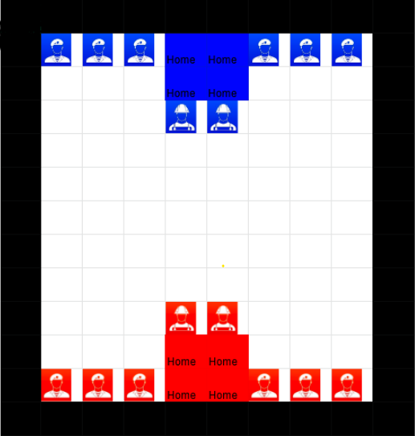

# QuVasion: a Quantum Game Combining Elements of Risk, Stratego, Chess, and Minesweeper
Taurean Lee, Danny Samuels, Riya Tyagi, Christain Rainer, and Adam Gluck

## Introduction 

Quantum mechanics and quantum computing are quite inaccessible during these times. Quantum is STEM-heavy, and while it appears cool, is often intimidating or even boring to the everday person. However, if quantum could make a fun, strategy-based, and interesting game, perhaps we could educate and engage the world. Quantum is a field that will likley be ubiquitous in the future, and now, more than ever, it is important that we take steps to open up the field for others.

We wanted to take this iniative by designing and building QuVasion.

## Abstract

## Rules of the Game

Our goal was to incorporate essential quantum mechanics and quantum computing principles such as superposition, entanglement, and interference to develop a strategy game in which players must use quantum objects and game theory to their advantage. Here's how the game works.

- The board is 11 x 8, and there are two players. Each player has a home base consisting of 4 out of 88 squares, as well as four soldiers and two builders.
- The winner of the game is the one who moves two of their soldiers into the other player's home base first.
- At the start of the game, each player chooses one mine spot on their half of the board.
- Each turn consists of two actions. An action includes almost any potential move, such as entangling two pieces, putting two pieces into a superposition, moving one piece forward, or collapsing a superposition. Moving along a road requires two actions, or one turn.
- The builder can create roads and walls. A player's soldiers can move to any spot on the road in one turn. A wall can block off a road and force it to diverge elsewhere.
- An opponent's soldier can kill a player's soldier or builder if it is the square next to it. When a piece is killed, it will return into the game in 2 moves.
- Entanglement: Two pieces that are entangled can be swapped at any moment with one action. In addition, if one entangled piece is killed, the other dies as well.
- Superposition: Superposition is used as a form of deception. A player can choose any spot on the board which they can travel to within one turn and superposition their piece between its current spot and the new location. A player can continue to form superpositions on the board, and then choose which position to collapse the superposition to. However, if a player form a superposition with a spot next to an opponent's player, the superposition can be measured in one action and automatically collapsed. 

## Demonstrations

As a team, we lacked the knowledge to implement the game in pyGame and Qiskit. Thus, we focused on designing the game instead. 
- Our board setup

  

## To-Do

Currently, we have mainly designed the game on paper. We were unable to succesfully implement it, although we did attempt to do so in game.py. In addition, all of us were incredibly busy this weekend, and were often not available. We did what we could, but a lot of it was not done as a group.

When we have a chance, we hope to implement this game in the future. For now, we present our design, rules, and structure.

